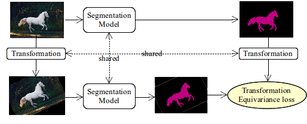

# Transformation equivariance loss
Implementation of transformation equivariance (TE) loss (or transformation
consistency loss).

The loss is used in our paper [Semi-supervised Keypoint Localization](https://openreview.net/pdf?id=yFJ67zTeI2) by Olga Moskvyak, Frederic Maire, Feras Dayoub and Mahsa Baktashmotlagh accepted to ICLR 2021.


## Overview
TE loss ensures that the output of the model stays consisten with the changes of the input.
The loss can be applied

Our method for a semi-supervised method for keypoint localization learns keypoint heatmaps and semantic keypoint representations simultaneously. The model learns from a subset of labeled images and a set of unlabeled images. The method is the most benefitial in low data regimes.

The model is optimized with a supervised loss on the labeled subset and three unsupervised constraints:




We use TE loss for semi-supervised keypoint localization and observe that TE loss alone gave minor imporvements ... . In our work we complement the loss with learning additional representations.

See my [blog post](https://olgamoskvyak.github.io/blog/) or the [notebook](https://github.com/olgamoskvyak/tf_equivariance_loss/Examples.ipynb) for the details and examples.


## Usage
TE loss is best used in combination with other supervised and unsupervised losses.
It will not give good results if used alone on unlabeled data.

We use TE loss in our work for semi-supervised keypoint localization to learn
keypoint heatmaps on the unlabeled subset in combination with the supervised loss on
the labeled subset.

Similar losses are used in the following works:
* ELT loss (no implementation)
* [SCOPS: Self-Supervised Co-Part Segmentation](https://varunjampani.github.io/papers/hung19_SCOPS.pdf) implements Equivariance loss with TPS transformations ([code](https://github.com/NVlabs/SCOPS)).


## Results

TE loss is beneficial in semi-supervised keypoint localization as it improves
the PCK (percentage of correct keypoints) metric on three datasets with only
a subset of labeled data. More details about experimental setup and results
are in our [paper](https://openreview.net/pdf?id=yFJ67zTeI2).

| Method               | Dataset      | 5% labeled | 10% labeled | 20% labeled | 50% labeled |
|----------------------|--------------|------------|-------------|-------------|-------------|
| Supservised          | MPII         | 66.22±1.60 | 69.18±1.03  | 71.83±0.87  | 75.73±0.35  |
| Supervised + TE loss | MPII         | 68.27±0.64 | 71.03±0.46  | 72.37±0.58  | 77.75±0.31  |
| Supservised          | LSP          | 40.19±1.46 | 45.17±1.15  | 55.22±1.41  | 62.61±1.25  |
| Supervised + TE loss | LSP          | 41.77±1.56 | 47.22±0.91  | 57.34±0.94  | 66.81±0.62  |
| Supservised          | CUB-200-2011 | 85.77±0.38 | 88.62±0.14  | 90.18±0.22  | 92.60±0.28  |
| Supervised + TE loss | CUB-200-2011 | 86.54±0.34 | 89.48±0.25  | 90.86±0.13  | 92.26±0.06  |


## Examples
```
from tf_equivariance_loss import TfEquivarianceLoss

import torch
import torch.nn as nn

x = torch.rand((4, 3, 64, 64))
model = nn.Sequential(nn.Conv2d(3, 1, 1, bias=False))

tf_equiv_loss = TfEquivarianceLoss(
    transform_type='rotation',
    consistency_type='mse',
    batch_size=4,
    max_angle=90,
    input_hw=(64, 64)
)

# Generate a transformation
tf_equiv_loss.set_tf_matrices()

# Compute model on input image
fx = model(x)

# Transform output
tfx = tf_equiv_loss.transform(fx)

# Transform input image
tx = tf_equiv_loss.transform(x)

# Compute model on the transformed image
ftx = model(tx)

loss = tf_equiv_loss(tfx, ftx)

```

See the [notebook](https://github.com/olgamoskvyak/tf_equivariance_loss/Examples.ipynb) for examples on real data on segmentation model.


## Dependency

* Python >= 3.7
* PyTorch >= 1.5
* Torchvision >= 0.8
* [Kornia](https://github.com/kornia/kornia) = 0.3 (a differentiable computer vision library for PyTorch)


## Testing

```
pip install pytest
pip install xdoctest

cd tf_equivariance_loss
pytest

```


## Citation
Please consider citing our paper if you find this code useful for your research.
```
@inproceedings{ICLR_2021_Moskvyak,
	title = {Semi-supervised Keypoint Localization},
	author = {Olga Moskvyak, Frederic Maire, Feras Dayoub and Mahsa Baktashmotlagh},
	booktitle = {Proc. International Conference on Learning Representations (ICLR)},
	year = {2021}
}
```